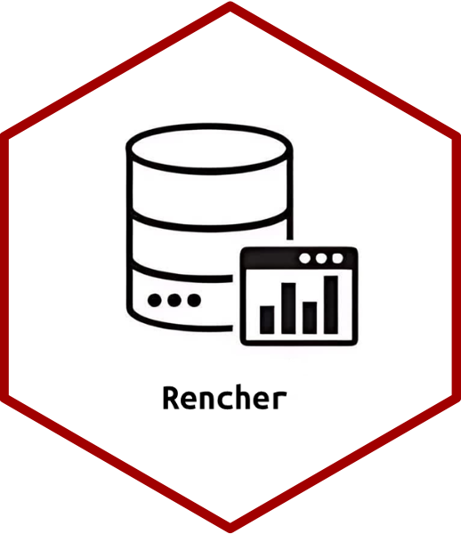

<!-- README.md is generated from README.Rmd. Please edit that file -->

# rencher

<!-- badges: start -->
<!-- badges: end -->

This package provides a collection of Datasets from the Book “Methods of
Multivariate Analysis (3rd)”.

## Installation

You can install the development version from
[CRAN](https://doi.org/10.32614/CRAN.package.rencher):

``` r
install.packages('rencher', dependencies = TRUE)
```

You can install the development version from [Github](https://github.com/AtefehRashidi/rencher):

``` r
# install.packages("remotes")
remotes::install_github("AtefehRashidi/rencher")
```



## License

This package is free and open source software, licensed under GPL-3.
